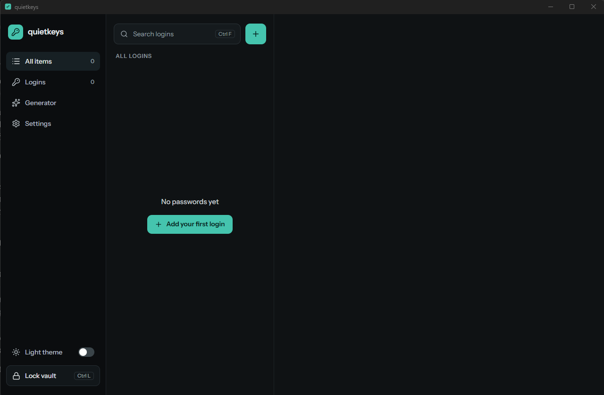
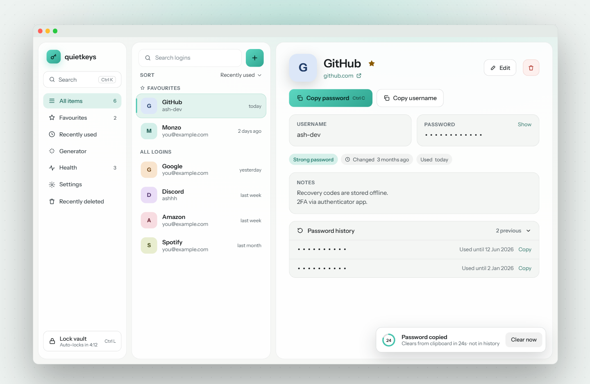

# quietkeys

**A local-first password vault.** An encrypted desktop password manager for Windows and macOS that keeps everything on your machine. No cloud, no accounts, no network access.

Built with Tauri, Rust and TypeScript.

> [!WARNING]
> quietkeys is a portfolio and learning project. It has **not been independently audited**. Please don't use it as your only store for passwords that matter. To report a vulnerability, see [SECURITY.md](SECURITY.md).






---

## Features

**Available now**

- Create an encrypted vault protected by a master password
- Add, edit, delete and search logins
- Passwords are hidden by default and hide again automatically after 30 seconds
- Unlock throttling after repeated wrong passwords
- Automatic backup of the previous vault on every save
- Dark and light themes
- Password generator and strength meter
- Copy to clipboard with auto-clear, excluded from clipboard history
- Auto-lock after inactivity
- Change master password
- Restore from backup and encrypted export

**In progress** (see [Roadmap](#roadmap))

- Browser extension for autofill

---

## Installing

Release downloads are on the [GitHub releases](https://github.com/Ashhhh66/quietkeys/releases) page: a Windows installer (`.msi`), a macOS disk image (`.dmg`) built for both Apple silicon and Intel, and `SHA256SUMS.txt`.

These builds are not code-signed, so the operating system warns the first time you open the app.

### Windows

SmartScreen may say that Windows protected your PC. Choose **More info**, then **Run anyway**.

### macOS

macOS blocks the app the first time you open it. Go to **System Settings > Privacy & Security** and choose **Open Anyway** next to the message about quietkeys.

### Check the download

`SHA256SUMS.txt` lists one SHA-256 hash for each file. The hash of the file you downloaded has to match the line for that file name.

On Windows, in PowerShell, from the folder that contains the installer:

```powershell
Get-FileHash .\quietkeys_1.0.0_x64_en-US.msi -Algorithm SHA256
```

On macOS, in Terminal:

```bash
shasum -a 256 quietkeys_1.0.0_universal.dmg
```

Use the file names from the release if they differ. PowerShell prints the hash in uppercase; `SHA256SUMS.txt` uses lowercase. The two match when the characters are the same.

---

## Security design

All cryptography runs in Rust. The encryption key never reaches the user interface.

### Encryption

|                  |                                                                                                                                      |
| ---------------- | ------------------------------------------------------------------------------------------------------------------------------------ |
| Key derivation   | **Argon2id**, 64 MiB memory, 3 iterations, 1 lane, random 16-byte salt                                                               |
| Encryption       | **XChaCha20-Poly1305** with a fresh random 24-byte nonce on every save                                                               |
| Randomness       | The operating system's CSPRNG only                                                                                                   |
| Header integrity | The file header (version, KDF settings, salt, cipher) is authenticated as associated data, so any change to it makes decryption fail |

- The master password is **never stored** in any form. There is no password hash or verifier: a wrong password simply fails to decrypt.
- Every failure (wrong password, tampered file, wrong nonce) returns the same generic error, so an attacker learns nothing about which part was wrong.
- The master password is normalised to Unicode NFC, and non-ASCII spaces are mapped to a normal space, based on RFC 8265's OpaqueString profile (not a full implementation). The same password therefore works across keyboards and operating systems.
- Argon2 settings are checked against a minimum and a maximum when a vault is loaded. Vaults with settings weaker than the current defaults are automatically re-encrypted with the defaults and a new salt on the next save.

### Handling secrets in memory

- The key, decrypted entries and passwords are wiped from memory when the vault locks (`zeroize`, `secrecy`).
- The entry list sent to the interface contains titles, usernames and URLs only. A password is sent only when you reveal it, one at a time.
- Debug output redacts passwords and notes, and error messages never include data from the vault.

### Storing the vault

- The vault is a single file in your local app data folder (never a roaming profile):
  - Windows: `%LOCALAPPDATA%\com.quietkeys.app\vault.quietkeys`
  - macOS: `~/Library/Application Support/com.quietkeys.app/vault.quietkeys`
- On macOS the file is readable by your user only (`0600`). On Windows it inherits the per-user permissions of the app data folder.
- Saves are **atomic**: the new vault is written to a temporary file, flushed to disk and renamed into place, so a crash leaves either the old vault or the new one, never a mix.
- Before each save, the current vault is copied to `vault.quietkeys.bak`, but only if it decrypts correctly, so a corrupted file can never replace a good backup.

### The app itself

- No network requests of any kind. Fonts are bundled and entries use letter avatars instead of downloaded website icons.
- A strict Content Security Policy, and every Tauri command needs its own permission.
- Unlock is throttled after 3 wrong passwords (1s, 2s, 4s… up to 30s), enforced in Rust, and only one unlock attempt can run at a time.
- New master passwords must be at least 12 characters with no control characters.

### Vault file format

```json
{
  "version": 1,
  "kdf": { "alg": "argon2id", "m_kib": 65536, "t": 3, "p": 1, "salt": "<base64>" },
  "cipher": { "alg": "xchacha20poly1305", "nonce": "<base64>" },
  "ciphertext": "<base64>"
}
```

---

## Threat model

**Protects against**

- Someone who copies or steals the vault file
- Tampering with the vault file
- Guessing the master password at your machine (throttling)
- Corrupted saves and crashes during a save

**Does not protect against**

- Malware or keyloggers on your computer
- A weak master password
- Someone using your computer while the vault is unlocked
- Memory forensics on an already-compromised machine

**Known limitations**

- The master password and revealed passwords pass through JavaScript strings in the app's webview, which can't be reliably wiped from memory. Rust-side secrets are wiped.
- Serialising the vault can leave small fragments of plaintext in freed memory. The final buffer is wiped and pre-allocated to keep this to a minimum.
- The unlock throttle is held in memory and resets when the app restarts. It slows guessing at the machine, while Argon2id protects a stolen vault file.
- There is no password reset. If you forget your master password, the vault can't be recovered.

---

## Building from source

### Prerequisites

- [Rust](https://www.rust-lang.org/tools/install) (stable)
- [Node.js](https://nodejs.org/) (LTS)
- The Tauri prerequisites for your operating system: see [Tauri's guide](https://tauri.app/start/prerequisites/)

### Run

```bash
git clone https://github.com/Ashhhh66/quietkeys.git
cd quietkeys
npm install
npm run tauri dev
```

### Test and check

```bash
# Rust
cd src-tauri
cargo test
cargo clippy --all-targets -- -D warnings
cargo fmt --check

# Frontend
cd ..
npm test
npm run lint
npm run format:check
```

### Build an installer

```bash
npm run tauri build
```

Builds are not yet code-signed. See [Installing](#installing) for the Windows and macOS warnings.

---

## Tech stack

| Layer     |                                                                 |
| --------- | --------------------------------------------------------------- |
| App shell | Tauri 2                                                         |
| Interface | React, TypeScript, Vite, Tailwind CSS                           |
| Core      | Rust                                                            |
| Crypto    | `argon2`, `chacha20poly1305`, `getrandom`, `zeroize`, `secrecy` |
| Tests     | `cargo test`, Vitest, Testing Library                           |

## Project structure

```
src-tauri/src/
  crypto.rs     Key derivation, encryption and decryption
  vault.rs      File format, loading, atomic saves and backups
  state.rs      Lock state, throttling and entry operations
  commands.rs   The Tauri commands, the only bridge to the UI
  error.rs      Error types that never leak secrets
src/
  api.ts        Typed wrappers for every command
  screens/      Setup, Unlock, Vault and entry editor
```

---

## Roadmap

The full list, including optional and out-of-scope work, is in [ROADMAP.md](ROADMAP.md). What has shipped is in the [changelog](CHANGELOG.md).

- [x] Phase 0: project setup
- [x] Phase 1: crypto and vault engine
- [x] Phase 2: app state and commands
- [x] Phase 3: core interface
- [x] Phase 4: generator, clipboard, auto-lock, change master password, backups
- [ ] Phase 5: polish, installers and CI, ending with the v1 release
- [ ] Phase 6: onboarding and Emergency Kit, vault health, import
- [ ] Phase 7: recovery code with vault format v2, choosing the vault location with conflict detection, TOTP
- [ ] Phase 8: native host and pairing
- [ ] Phase 9: browser extension

## License

[MIT](LICENSE)
